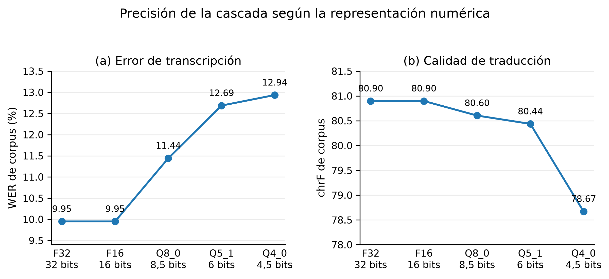
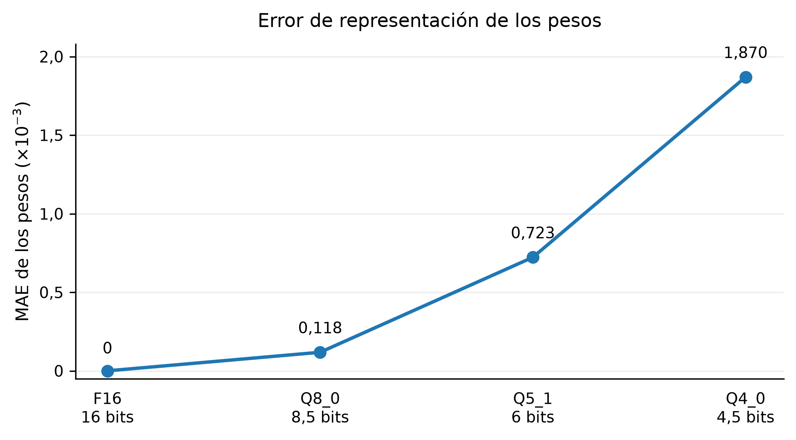
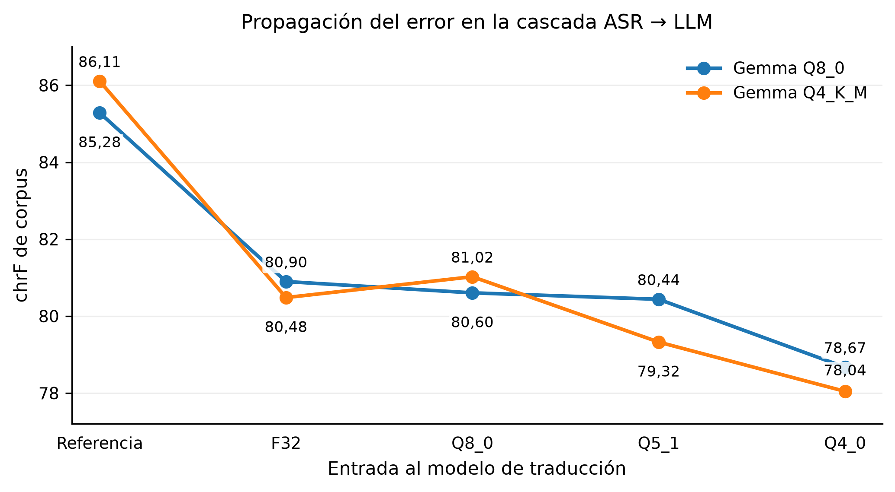

<div align="center">

# Cuantización y Propagación del Error en Traducción en Tiempo Real

### Un estudio numérico de la cascada ASR → LLM para traducción médica on-device

[](https://julialang.org/)
[](https://www.python.org/)
[](https://github.com/ggml-org/whisper.cpp)
[](https://ollama.com)
[]()

*Estudio de caso — **INF-321 Computación Numérica** · Ingeniería Civil Informática · Universidad Católica del Maule*

</div>

---

Un centro de atención de urgencia necesita traducir en tiempo real entre pacientes que no hablan español y personal clínico — pero por confidencialidad de los datos, todo debe ejecutarse **localmente, sin APIs en la nube**, en un equipo sin GPU dedicada. Este repositorio documenta un experimento numérico completo que responde una pregunta muy concreta:

> **¿Cuánta precisión numérica se puede sacrificar — reduciendo los pesos de los modelos de 32 a 4.5 bits — antes de que la traducción deje de ser clínicamente confiable?**

Se implementa y evalúa una cascada de dos etapas, **whisper.cpp (ASR) → Ollama/Gemma 3 (LLM)**, en cinco formatos de cuantización distintos, midiendo de forma controlada y reproducible el error numérico introducido en cada etapa y cómo se propaga hasta el resultado final.

---

## Tabla de Contenidos

1. [Resumen Ejecutivo](#resumen-ejecutivo)
2. [Planteamiento del Problema](#planteamiento-del-problema)
3. [Arquitectura del Sistema](#arquitectura-del-sistema)
4. [Fundamento Numérico y Cuantización](#fundamento-numérico-y-cuantización)
5. [Entorno Experimental](#entorno-experimental)
6. [Obtención de los Modelos](#obtención-de-los-modelos)
7. [Corpus de Audio](#corpus-de-audio)
8. [Estructura del Repositorio](#estructura-del-repositorio)
9. [Requisitos e Instalación](#requisitos-e-instalación)
10. [Uso del Repositorio](#uso-del-repositorio)
11. [Resultados](#resultados)
12. [Limitaciones y Alcance](#limitaciones-y-alcance)
13. [Reproducibilidad](#reproducibilidad)
14. [Autores y Contexto Académico](#autores-y-contexto-académico)
15. [Créditos y Licencias de Terceros](#créditos-y-licencias-de-terceros)
16. [Cómo Citar este Trabajo](#cómo-citar-este-trabajo)

---

## Resumen Ejecutivo

Se evaluaron **cinco formatos numéricos** del modelo ASR (F32, F16, Q8_0, Q5_1, Q4_0) sobre un corpus de 10 relatos clínicos, midiendo su efecto en la transcripción (WER, CER), la traducción (chrF) y el consumo de recursos (RAM, disco, RTF).

| Formato | Bits/peso | WER (%) | chrF | RAM pico | RTF | Evaluación |
|---|---|---|---|---|---|---|
| **F32** | 32.0 | 9.950 | 80.898 | 526.38 MiB | 0.0392 | Referencia de mayor precisión |
| **F16** | 16.0 | 9.950 | 80.898 | 341.94 MiB | 0.0307 | Opción conservadora |
| **Q8_0** | 8.5 | 11.443 | 80.604 | 255.70 MiB | 0.0294 | **✅ Mejor compromiso técnico** |
| **Q5_1** | 6.0 | 12.687 | 80.437 | 227.42 MiB | 0.0306 | Compresión más agresiva, mayor WER |
| **Q4_0** | 4.5 | 12.935 | 78.671 | 208.91 MiB | 0.0285 | Mayor pérdida final, no recomendado |

**Hallazgo principal:** el error numérico y la calidad final **no se degradan de forma proporcional**. Al pasar de F32 a Q8_0, el WER aumenta un 15.0 % relativo (+1.49 puntos), pero la calidad de traducción (chrF) cae apenas un 0.36 % (−0.29 puntos) — mientras la memoria pico se reduce un **51.4 %**. La degradación seria solo se vuelve evidente en Q4_0, donde chrF cae más de 2 puntos frente a Q5_1.

**Recomendación técnica:** para el escenario evaluado, **Q8_0** ofrece el mejor equilibrio entre reducción de recursos y calidad, con un desempeño cercano a F32 pero a la mitad de la memoria. Aun así, se detectaron errores de transcripción capaces de alterar información clínicamente relevante (p. ej. *"severe"* → *"several"*, *"no known allergies"* → *"no knowledge"*) incluso en configuraciones de alta precisión — por lo que ninguna configuración debe considerarse una validación clínica definitiva sin supervisión humana. Ver [Limitaciones y Alcance](#limitaciones-y-alcance).

---

## Planteamiento del Problema

El equipo disponible (un computador de escritorio/portátil sin GPU dedicada) no tiene memoria suficiente para ejecutar ambos modelos —ASR y LLM— en precisión completa (`binary32`, IEEE-754). La solución es la **cuantización**: representar los pesos con un ancho de palabra menor (F16, Q8_0, Q5_1, Q4_0), reduciendo memoria y latencia a costa de introducir un **error de representación** en cada peso, que luego se propaga a través de toda la cascada de inferencia.

El objetivo del estudio es tratar este problema como lo que es: un problema de **análisis numérico aplicado**, no solo de ingeniería de software. Esto implica:

- Definir formalmente el error introducido por cada formato y verificarlo experimentalmente contra su cota teórica.
- Separar las fuentes de error (ASR vs. LLM) mediante un diseño experimental controlado.
- Cuantificar cómo se **amplifica o atenúa** el error al propagarse por la cascada.
- Traducir los resultados numéricos en una recomendación técnica accionable, con sus riesgos residuales.

Todo el procesamiento se ejecuta **on-device** (sin servicios de nube), condición impuesta tanto por la confidencialidad de datos clínicos como por el objetivo del estudio: controlar completamente la representación numérica de los modelos.

---

## Arquitectura del Sistema

La arquitectura es una cascada de dos etapas, cada una evaluada en múltiples niveles de cuantización:

```
Audio (WAV) ──► whisper.cpp (ASR) ──► Texto inglés ──► Ollama/Gemma 3 (LLM) ──► Texto español
                   │                                        │
              Formatos:                                Cuantizaciones:
              F32, F16, Q8_0,                          Q8_0 (gemma3:1b-it-q8_0)
              Q5_1, Q4_0                               Q4_K_M (gemma3:1b)
```

1. **Etapa ASR**: [whisper.cpp](https://github.com/ggml-org/whisper.cpp) transcribe el audio en inglés a texto.
2. **Etapa LLM**: [Ollama](https://ollama.com) con Gemma 3 1B traduce el texto inglés al español.

Ambas etapas corren completamente locales; no hay llamadas de red durante la inferencia.

---

## Fundamento Numérico y Cuantización

### Punto flotante como referencia

La representación en punto flotante de un número real $x$ se modela como:

$$fl(x) = x(1 + \delta), \qquad |\delta| \le u$$

donde $u$ es la **unidad de redondeo**. Para los formatos IEEE-754 utilizados como referencia:

$$u_{32} = 2^{-24} \approx 5.960 \times 10^{-8}, \qquad u_{16} = 2^{-11} \approx 4.883 \times 10^{-4}$$

### Cuantización en bloques (GGML/GGUF)

Los formatos `Q8_0`, `Q5_1` y `Q4_0` agrupan los pesos en bloques de 32 valores que comparten un factor de escala $d$ (y, según el esquema, un desplazamiento $m$), almacenados en punto flotante de 16 bits. Cada peso se reconstruye como:

$$\tilde{w}_i = d\,q_i + m, \qquad q_i \in \mathbb{Z} \cap [q_{min}, q_{max}]$$

lo que introduce un error de representación $\varepsilon_i = \tilde{w}_i - w_i$ acotado, bajo redondeo al nivel más cercano, por:

$$|\varepsilon_i| \le \frac{|d|}{2} \quad \text{(cota ideal de medio paso)}$$

### Bits efectivos por peso

Para comparar formatos de forma justa se amortiza el costo del factor de escala por bloque:

| Formato | Bits/peso | Esquema |
|---|---|---|
| F32 | 32.0 | IEEE-754 binary32 |
| F16 | 16.0 | IEEE-754 binary16 |
| Q8_0 | 8.5 | 32 pesos × 8 bits + escala FP16 |
| Q5_1 | 6.0 | 32 pesos × 5 bits + escala FP16 + offset FP16 |
| Q4_0 | 4.5 | 32 pesos × 4 bits + escala FP16 |

### Verificación experimental de la cota

Se comparó cada peso reconstruido contra su valor F32 original (71.504.384 pesos por formato, 97 tensores) para verificar la cota $|\varepsilon_i| \le |d|/2$:

| Formato | MAE absoluto | Error relativo mediano | Cumplimiento de la cota $d/2$ |
|---|---|---|---|
| F16 | 0 | 0 % | No aplica |
| Q8_0 | $1.182 \times 10^{-4}$ | 0.6382 % | 99.34 % |
| Q5_1 | $7.227 \times 10^{-4}$ | 3.986 % | 99.76 % |
| Q4_0 | $1.870 \times 10^{-3}$ | 10.30 % | 99.71 % |

Más del 99 % de los pesos evaluados en los tres formatos cuantizados cumple la cota teórica de medio paso, confirmando que la implementación de GGML se comporta según lo esperado por la teoría. El detalle completo (estadísticas de $d$, RMSE, error máximo por tensor) está en el **Anexo D** del informe (`docs/informe/`).

---

## Entorno Experimental

| Componente | Detalle |
|---|---|
| **Hardware** | MacBook Air (M1, 2020), 8 GB RAM unificada, SSD 256 GB |
| **CPU** | Apple M1 — 4 núcleos de rendimiento + 4 de eficiencia |
| **GPU** | GPU integrada Apple M1 (7 núcleos, Metal) |
| **Sistema operativo** | macOS Tahoe 26.5.2 |
| **Julia** | 1.12.6 |
| **whisper.cpp** | v1.9.2 (commit `592feef04a1802b18cbeffd0fd0eb5d02570c2ec`) |
| **Ollama** | 0.32.2 |
| **Python** | 3.14 (para scripts de gráficos y benchmarks auxiliares) |

---

## Obtención de los Modelos

### Modelo ASR — Whisper Base

El modelo de referencia en precisión completa (**F32**) se obtuvo a partir del repositorio oficial de [OpenAI Whisper](https://github.com/openai/whisper), entrenado en 680.000 horas de audio multilingüe. Se utilizó la variante **Base** (74 M de parámetros).

El modelo F32 se convirtió al formato GGML compatible con whisper.cpp usando el script de conversión incluido (`convert-pt-to-ggml.py`), obteniendo `ggml-base-f32.bin` (291 MB). A partir de este, se generaron las versiones cuantizadas con la herramienta `whisper-quantize`:

| Formato | Bits efectivos/peso | Tamaño en disco | Representación |
|---|---|---|---|
| **F32** | 32.0 | 291 MB | IEEE-754 binary32 |
| **F16** | 16.0 | 148 MB | IEEE-754 binary16 |
| **Q8_0** | 8.5 | 81.77 MB | Bloques de 32 pesos × 8 bits + escala FP16 |
| **Q5_1** | 6.0 | 59.71 MB | Bloques de 32 pesos × 5 bits + escala FP16 + offset FP16 |
| **Q4_0** | 4.5 | 46.47 MB | Bloques de 32 pesos × 4 bits + escala FP16 |

```bash
# Cuantización manual a partir del modelo F32
for t in q8_0 q5_1 q4_0; do
  ./whisper.cpp/build/bin/whisper-quantize \
    whisper.cpp/models/ggml-base-f32.bin \
    whisper.cpp/models/ggml-base-$t.bin \
    $t
done
```

### Modelo LLM — Gemma 3 1B

Se utilizó [Gemma 3](https://ai.google.dev/gemma) de Google DeepMind (999.89 M de parámetros) servido con Ollama, en dos cuantizaciones distintas, para aislar el efecto numérico propio del LLM del efecto introducido por el ASR:

| Tag en Ollama | Cuantización | Tamaño | ID |
|---|---|---|---|
| `gemma3:1b-it-q8_0` | Q8_0 | 1.1 GB | `0fdb9c7fefee` |
| `gemma3:1b` | Q4_K_M | 815 MB | `8648f39daa8f` |

---

## Corpus de Audio

El corpus consta de **10 segmentos de audio** en inglés (grabación propia, con consentimiento de los hablantes), de 15–30 s cada uno, que simulan relatos clínicos de pacientes en un servicio de urgencia. Duración total: **212.288 s**.

| # | Archivo | Escenario clínico |
|---|---|---|
| 1 | `audio01(dolor toracico).wav` | Dolor torácico severo |
| 2 | `audio02(alergia).wav` | Alergia a penicilina |
| 3 | `audio03(accidente).wav` | Accidente en bicicleta |
| 4 | `audio04(dolor abdominal).wav` | Dolor abdominal |
| 5 | `audio05(diabetes).wav` | Diabetes tipo 2 |
| 6 | `audio06(fiebre).wav` | Fiebre alta |
| 7 | `audio07(respiracion).wav` | Dificultad respiratoria |
| 8 | `audio08(herida).wav` | Herida cortante en mano |
| 9 | `audio09(mareo).wav` | Mareo súbito |
| 10 | `audio10(dolor cabeza).wav` | Dolor de cabeza severo |

Transcripciones de referencia en `data/groundtruth.txt`; traducciones de referencia en `data/groundtruth_es.txt`.

---

## Estructura del Repositorio

```
.
├── README.md                              # Este archivo
├── .gitignore                             # Reglas de exclusión para Git
│
├── docs/                                  # Documentación del proyecto
│   ├── PAUTA.md                           # Rúbrica de evaluación del estudio de caso
│   ├── especificacion_entorno.txt         # Especificación completa del entorno experimental
│   ├── especificacion_modelos.txt         # Representación numérica detallada por formato
│   └── informe/                           # Informe LaTeX
│       ├── estudio_casos_unidad1-2.tex
│       └── estudio_casos_unidad1-2.pdf
│
├── data/                                  # Datos de entrada
│   ├── audio/                             # Corpus: 10 archivos WAV (inglés, 15-30s c/u)
│   ├── groundtruth.txt                    # Transcripciones de referencia (inglés)
│   └── groundtruth_es.txt                 # Traducciones de referencia (español)
│
├── scripts/                               # Todos los scripts ejecutables
│   ├── pipelines/                         # Pipelines interactivos
│   │   ├── asr_pipeline.jl                # Pipeline ASR básico
│   │   └── translate_pipeline.jl          # Pipeline de traducción básico
│   ├── benchmarks/                        # Scripts de benchmarking
│   │   ├── benchmark_asr.jl               # Benchmark R1/R2: ASR completo
│   │   ├── benchmark_translate.jl         # Benchmark R2: traducción
│   │   ├── benchmark_r3.jl                # Benchmark R3: propagación del error
│   │   ├── benchmark_weight_error.py      # Benchmark R1: error de cuantización
│   │   ├── benchmark_threads.py           # Benchmark R4: efecto de hilos
│   │   ├── benchmark_reduction_order.py   # Benchmark R4: orden de reducción
│   │   └── medir_ram.sh                   # Medición de RAM (RSS) por formato
│   └── figures/                           # Generadores de figuras
│       ├── grafico_figura1.py             # Figura 1: precisión vs. bits por peso
│       ├── grafico_figura2.py             # Figura 2: error de representación
│       └── grafico_figura3.py             # Figura 3: propagación del error ASR→LLM
│
├── results/                               # Todos los resultados experimentales
│   ├── csv/                               # Datos tabulares (ver tabla completa más abajo)
│   ├── figures/                           # Figuras generadas (PNG y SVG)
│   └── Resultados.xlsx                    # Tabla consolidada de resultados
│
├── output/                                # Salidas crudas de ejecución
│   ├── transcriptions/                    # Transcripciones ASR por formato y repetición
│   ├── translations/                      # Traducciones LLM (_hyp.txt y _ref.txt)
│   └── threads/                           # Transcripciones del experimento de hilos
│
├── whisper.cpp/                           # (git-ignored) Clonar externamente
└── whisper/                               # (git-ignored) OpenAI Whisper (para conversión F32)
```

---

## Requisitos e Instalación

### Dependencias

- [Julia](https://julialang.org/) ≥ 1.10 (probado con 1.12.6)
- [Python](https://www.python.org/) ≥ 3.10 con `numpy` y `matplotlib`
- [whisper.cpp](https://github.com/ggml-org/whisper.cpp) compilado localmente
- [Ollama](https://ollama.com) con los modelos Gemma 3 descargados
- `curl` en el PATH (usado por los scripts de traducción)

### Inicio Rápido

```bash
# 1. Clonar este repositorio
git clone https://github.com/Williams-Campos/asr-llm-error-propagation-case-study.git
cd asr-llm-error-propagation-case-study

# 2. Compilar whisper.cpp en la versión exacta usada en el estudio
git clone https://github.com/ggml-org/whisper.cpp
cd whisper.cpp && git checkout 592feef04a1802b18cbeffd0fd0eb5d02570c2ec
cmake -B build && cmake --build build -j --config Release
cd ..

# 3. Descargar el modelo F16 base y generar las variantes cuantizadas
./whisper.cpp/models/download-ggml-model.sh base
for t in q8_0 q5_1 q4_0; do
  ./whisper.cpp/build/bin/whisper-quantize whisper.cpp/models/ggml-base.bin \
    whisper.cpp/models/ggml-base-$t.bin $t
done

# 4. Preparar Ollama
ollama pull gemma3:1b-it-q8_0
ollama pull gemma3:1b
ollama serve &

# 5. Ejecutar el pipeline ASR sobre el corpus
julia scripts/pipelines/asr_pipeline.jl whisper.cpp/models/ggml-base.bin
```

Los pasos detallados (incluyendo cómo obtener el modelo **F32** desde OpenAI Whisper, necesario como referencia de máxima precisión) se explican a continuación.

<details>
<summary><b>Ver instalación completa paso a paso</b></summary>

#### Compilar whisper.cpp

```bash
git clone https://github.com/ggml-org/whisper.cpp
cd whisper.cpp
git checkout 592feef04a1802b18cbeffd0fd0eb5d02570c2ec  # v1.9.2
cmake -B build
cmake --build build -j --config Release
cd ..
```

#### Obtener el modelo F32 desde OpenAI Whisper

```bash
# Clonar OpenAI Whisper
git clone https://github.com/openai/whisper
cd whisper
pip install -e .

# Descargar el modelo Base de OpenAI (se descarga automáticamente al primer uso)
python -c "import whisper; whisper.load_model('base')"

# Convertir a formato GGML F32 usando el script de whisper.cpp
cd ../whisper.cpp
python models/convert-pt-to-ggml.py ~/.cache/whisper/base.pt ../whisper/ models/
mv models/ggml-model.bin models/ggml-base-f32.bin
cd ..
```

#### Descargar el modelo F16 (línea base precompilada)

```bash
cd whisper.cpp
./models/download-ggml-model.sh base   # descarga ggml-base.bin (F16)
mv models/ggml-base.bin models/ggml-base-f16.bin
cd ..
```

#### Generar las variantes cuantizadas

```bash
cd whisper.cpp
for t in q8_0 q5_1 q4_0; do
  ./build/bin/whisper-quantize \
    models/ggml-base-f32.bin \
    models/ggml-base-$t.bin \
    $t
done
cd ..
```

#### Preparar Ollama

```bash
ollama pull gemma3:1b-it-q8_0   # Gemma 3 1B en Q8_0
ollama pull gemma3:1b            # Gemma 3 1B en Q4_K_M
ollama serve                     # Iniciar el servidor (si no está corriendo)
```

</details>

---

## Uso del Repositorio

### Pipelines Interactivos

**`scripts/pipelines/asr_pipeline.jl`** — Transcribe los 10 archivos WAV de `data/audio/` con `whisper-cli` y calcula métricas contra `data/groundtruth.txt`.

```bash
julia scripts/pipelines/asr_pipeline.jl whisper.cpp/models/ggml-base-f32.bin
```
**Métricas:** WER, CER, RTF. **Salida:** `output/transcriptions/`.

**`scripts/pipelines/translate_pipeline.jl`** — Traduce las transcripciones de `output/transcriptions/` vía Ollama y calcula chrF. Debe ejecutarse **después** de `asr_pipeline.jl`.

```bash
julia scripts/pipelines/translate_pipeline.jl gemma3:1b-it-q8_0 English
```
**Métricas:** chrF. **Salida:** `output/translations/`.

### Benchmarks Experimentales

| Script | Propósito | Diseño experimental | Salidas |
|---|---|---|---|
| `benchmark_asr.jl` (R1/R2) | Efecto de la cuantización sobre el ASR | 5 formatos × 10 audios × 5 repeticiones = 250 transcripciones | `results/csv/asr_per_audio.csv`, `asr_summary.csv`, `asr_metadata.csv` |
| `benchmark_translate.jl` (R2) | Efecto del ASR sobre la traducción, LLM fijo en Q8_0 | 5 formatos ASR × 10 audios | `translation_per_audio.csv`, `translation_summary.csv` |
| `benchmark_r3.jl` (R3) | Propagación del error en la cascada completa | 2 LLM × 5 condiciones × 10 audios = 100 traducciones | `r3_per_audio.csv`, `r3_summary.csv` |
| `benchmark_weight_error.py` (R1) | Error de cuantización peso a peso vs. cota teórica $d/2$ | 97 tensores, 70.6 M pesos cuantizados | `quantization_error_summary.csv`, `quantization_error_by_tensor.csv` |
| `benchmark_threads.py` (R4) | Efecto del número de hilos sobre latencia y estabilidad | 2 modelos × 4 configuraciones de hilos × 3 audios × 3 repeticiones | `thread_experiment.csv`, `thread_summary.csv` |
| `benchmark_reduction_order.py` (R4) | Efecto del orden de suma en aritmética de punto flotante | 7 estrategias de reducción sobre un tensor de atención | `reduction_order_experiment.csv` |
| `medir_ram.sh` | Memoria pico (RSS) de whisper-cli por formato | `/usr/bin/time -l` | `ram_resultados.csv` |

```bash
julia scripts/benchmarks/benchmark_asr.jl              # 5 repeticiones (por defecto)
julia scripts/benchmarks/benchmark_translate.jl
julia scripts/benchmarks/benchmark_r3.jl
python scripts/benchmarks/benchmark_weight_error.py
python scripts/benchmarks/benchmark_threads.py
python scripts/benchmarks/benchmark_reduction_order.py
bash scripts/benchmarks/medir_ram.sh
```

### Generación de Figuras

```bash
python scripts/figures/grafico_figura1.py   # → results/figures/figura_1_precision_bits.*
python scripts/figures/grafico_figura2.py   # → results/figures/figura_2_error_representacion.*
python scripts/figures/grafico_figura3.py   # → results/figures/figura_3_propagacion_asr_llm.*
```

---

## Resultados

### Síntesis de Resultados

<p align="center">
  
  
</p>

Como se observa en la Figura 1, F32 y F16 tienen desempeño idéntico (el modelo original de Whisper Base se distribuye en F16, por lo que no hay pérdida adicional). Al reducir la precisión aumenta el WER de forma progresiva, mientras chrF se mantiene relativamente estable hasta Q5_1 y cae con más fuerza recién en Q4_0 — evidencia de que **el error de transcripción y la calidad de traducción no se degradan de forma proporcional**.

### Propagación del Error en la Cascada (R3)

Para aislar las fuentes de error se compararon tres condiciones de entrada al LLM — la transcripción de referencia, la salida del ASR en F32 y la salida del ASR cuantizado — usando WER como error de entrada ($E_{in}$) y $E_{out} = 100 - chrF$ como error de salida:

<p align="center">
  
</p>

| Cuantización LLM | Condición | $E_{in}$: WER (%) | chrF salida | $E_{out}$ (pts) | $\Delta E_{out}$ (pts) |
|---|---|---|---|---|---|
| Gemma Q8_0 | Referencia → LLM | 0.000 | 85.283 | 14.717 | 0.000 |
| Gemma Q8_0 | F32 → LLM | 9.950 | 80.898 | 19.102 | 4.385 |
| Gemma Q8_0 | Q8_0 → LLM | 11.443 | 80.604 | 19.396 | 4.679 |
| Gemma Q8_0 | Q5_1 → LLM | 12.687 | 80.437 | 19.563 | 4.846 |
| Gemma Q8_0 | Q4_0 → LLM | 12.935 | 78.671 | 21.329 | 6.612 |
| Gemma Q4_K_M | Referencia → LLM | 0.000 | 86.106 | 13.894 | 0.000 |
| Gemma Q4_K_M | F32 → LLM | 9.950 | 80.482 | 19.518 | 5.624 |
| Gemma Q4_K_M | Q8_0 → LLM | 11.443 | 81.023 | 18.977 | 5.083 |
| Gemma Q4_K_M | Q5_1 → LLM | 12.687 | 79.325 | 20.675 | 6.781 |
| Gemma Q4_K_M | Q4_0 → LLM | 12.935 | 78.044 | 21.956 | 8.062 |

La mayor caída de calidad aparece **al incorporar la salida del ASR** (Referencia → F32), más que al aumentar la cuantización del ASR en sí. Esto indica que la etapa que más contribuye al error compuesto es la transcripción imperfecta, no la cuantización adicional del ASR una vez que ya hay errores de reconocimiento. Q4_0 presenta la mayor degradación final en ambas cuantizaciones del LLM.

### Archivos CSV Completos

Todos los resultados tabulares se encuentran en `results/csv/`:

| Archivo | Descripción |
|---|---|
| `asr_per_audio.csv` | WER, CER, RTF por audio, formato y repetición (250 filas) |
| `asr_summary.csv` / `asr_metadata.csv` | Promedios y metadatos del benchmark ASR |
| `quantization_error_summary.csv` | MAE, RMSE, error relativo, cota $d/2$ por formato |
| `quantization_error_by_tensor.csv` | Error por tensor individual del modelo (97 tensores) |
| `translation_per_audio.csv` / `translation_summary.csv` | chrF por audio y formato ASR (R2) |
| `translation_metadata.csv` | Parámetros del experimento R2 |
| `r3_per_audio.csv` / `r3_summary.csv` | chrF por audio/LLM/condición (R3) |
| `r3_metadata.csv` | Parámetros del experimento R3 |
| `thread_experiment.csv` / `thread_summary.csv` | Efecto del número de hilos sobre RTF y estabilidad |
| `reduction_order_experiment.csv` | Error de cada estrategia de suma en punto flotante |
| `ram_resultados.csv` | RSS por formato y repetición |

### Salidas Crudas de Ejecución

```
output/transcriptions/{F32,F16,Q8_0,Q5_1,Q4_0}/run_{01..05}/
    audio01(dolor toracico).txt
    ...
    audio10(dolor cabeza).txt

output/translations/{F32,F16,Q8_0,Q5_1,Q4_0}/run_{01..05}/
    audio01(dolor toracico)_hyp.txt    # Traducción de la hipótesis ASR
    audio01(dolor toracico)_ref.txt    # Traducción de la referencia

output/threads/
    F32_audio01(dolor toracico)_t{1,2,4,8}_r{1,2,3}.txt
```

---

## Limitaciones y Alcance

Estos resultados deben interpretarse como una **recomendación técnica**, no como una validación clínica del sistema:

- **Corpus acotado**: 10 audios (212 s totales) grabados por los mismos hablantes. No captura variabilidad de acentos, ruido ambiental, ni condiciones clínicas reales de un servicio de urgencia.
- **Métricas agregadas vs. errores críticos**: WER, CER y chrF miden desempeño global, pero no distinguen la *gravedad semántica* de un error. Se documentaron casos concretos (Anexo H del informe) donde el ASR alteró información clínicamente relevante —localización del dolor, intensidad del síntoma, presencia de alergias— incluso en formatos de alta precisión.
- **Hardware único**: todos los experimentos corrieron en un solo equipo (Apple M1, 8 GB). Los tiempos de RTF y consumo de RAM no son directamente extrapolables a otro hardware.
- **Un solo par de modelos**: los resultados son específicos a Whisper Base + Gemma 3 1B; no se garantiza el mismo comportamiento con modelos de otro tamaño o familia.

Por estas razones, cualquier despliegue clínico real de este tipo de sistema requeriría validación adicional con supervisión humana en el circuito de traducción.

---

## Reproducibilidad

### Parámetros de decodificación ASR

| Parámetro | Valor |
|---|---|
| Idioma | `en` |
| Hilos | 4 |
| Beam size | 5 |
| Best-of | 5 |
| Temperatura | 0.0 |
| Incremento de temperatura | 0.0 |
| Fallback de temperatura | Deshabilitado (`-nf`) |
| GPU | Metal (Apple Silicon) |

### Parámetros del LLM (Ollama)

| Parámetro | Valor |
|---|---|
| Temperatura | 0.0 |
| Semilla | 42 |
| top_k | 64 |
| top_p | 0.95 |
| Streaming | `false` |

### Versiones exactas

| Software | Versión / Commit |
|---|---|
| whisper.cpp | v1.9.2 — `592feef04a1802b18cbeffd0fd0eb5d02570c2ec` |
| Ollama | 0.32.2 |
| Julia | 1.12.6 |
| Modelo Whisper | Base (74M parámetros) |
| Modelo LLM | Gemma 3 1B (`0fdb9c7fefee` Q8_0 / `8648f39daa8f` Q4_K_M) |

---

## Autores y Contexto Académico

| | |
|---|---|
| **Integrantes** | Benjamín Flores Alegría · Williams Campos Corvalán · Mauricio Castro Leal |
| **Asignatura** | INF-321 — Computación Numérica |
| **Carrera** | Ingeniería Civil Informática |
| **Institución** | Universidad Católica del Maule |
| **Docente** | Sergio Hernández |
| **Fecha de entrega** | 26 de agosto de 2026 |

La rúbrica de evaluación completa se encuentra en [`docs/PAUTA.md`](docs/PAUTA.md), el enunciado original del caso en el mismo documento, y el informe técnico completo (con todos los anexos, tablas y figuras) en [`docs/informe/estudio_casos_unidad1-2.pdf`](docs/informe/estudio_casos_unidad1-2.pdf).

---

## Créditos y Licencias de Terceros

- **Whisper** — [OpenAI](https://github.com/openai/whisper), licencia MIT. Utilizado para obtener el modelo F32 de referencia.
- **whisper.cpp** — [ggml-org](https://github.com/ggml-org/whisper.cpp), licencia MIT. Implementación en C/C++ del modelo Whisper sobre la biblioteca ggml.
- **Gemma 3** — [Google DeepMind](https://ai.google.dev/gemma). Modelo de lenguaje servido mediante Ollama, sujeto a los [términos de uso de Gemma](https://ai.google.dev/gemma/terms).
- **Ollama** — [ollama.com](https://ollama.com), licencia MIT.

El código propio de este repositorio (scripts de benchmarking, pipelines, generación de figuras) fue desarrollado íntegramente por los integrantes listados arriba con fines académicos. El corpus de audio es grabación propia con consentimiento de los hablantes.

---

## Cómo Citar este Trabajo

Si este repositorio te resulta útil como referencia, puedes citarlo así:

```
Flores Alegría, B., Campos Corvalán, W., & Castro Leal, M. (2026).
Cuantización y Propagación del Error en Traducción en Tiempo Real
[Estudio de caso, INF-321 Computación Numérica].
Universidad Católica del Maule.
https://github.com/Williams-Campos/asr-llm-error-propagation-case-study
```

